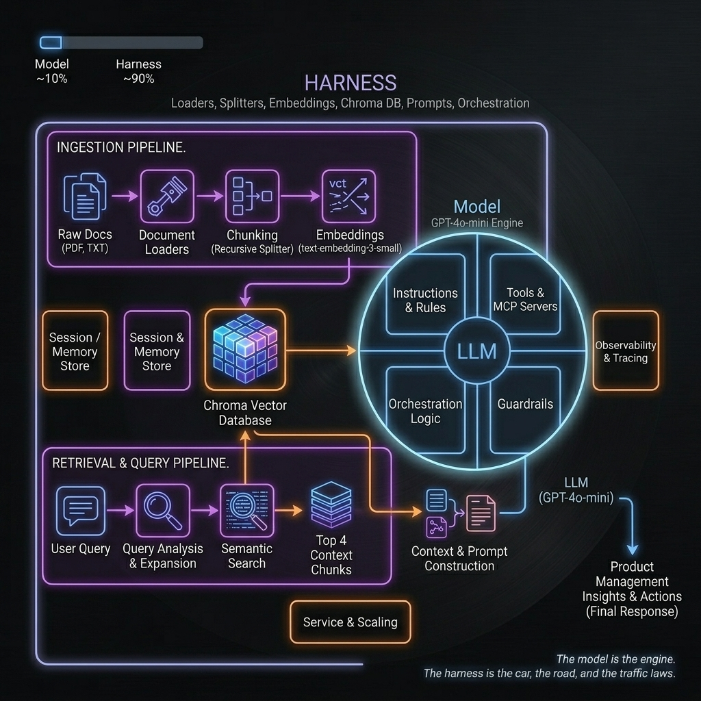
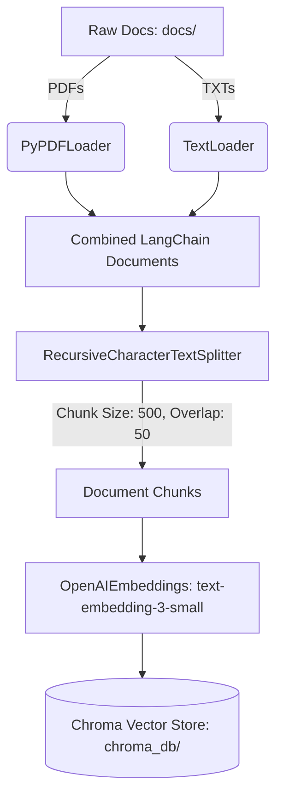
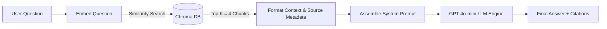

# PM RAG System Architecture & Processes

This document explains the complete RAG (Retrieval-Augmented Generation) pipeline for the Product Management Assistant. It covers the data ingestion flow (loading, chunking, embedding, and storage) and the retrieval & query flow (semantic search, context formatting, prompting, and LLM reasoning).

---

## 🏗️ System Architecture Diagram

The diagram below shows the complete flow of data from raw documents through the ingestion pipeline to the Chroma vector store, and how user queries trigger semantic retrieval, context assembly, and LLM reasoning.



*Click the image or locate it in your files to download the raw PNG:*
[Download rag_agent_architecture.png](rag_agent_architecture.png)

---

## 🔄 Step-by-Step Process Breakdown

### 1. The Ingestion Pipeline (`ingest.py`)
This pipeline converts raw, unstructured files into structured vector embeddings stored in a persistent database.



*   **Step 1.1: Document Loading**:
    *   PDF files are parsed page-by-page using LangChain's `PyPDFLoader`.
    *   Text files (.txt) are parsed using `TextLoader` with `utf-8` encoding.
*   **Step 1.2: Text Chunking & Splitting**:
    *   To keep documents within the LLM's context window and ensure semantic focus, files are split into smaller fragments using `RecursiveCharacterTextSplitter`.
    *   **Parameters**:
        *   `chunk_size = 500` tokens per chunk.
        *   `chunk_overlap = 50` tokens (keeps context continuous so sentences aren't split abruptly).
        *   `separators = ["\n\n", "\n", ". ", " ", ""]` (splits on paragraphs first, then falls back to lines, sentences, or words).
*   **Step 1.3: Vector Embedding generation**:
    *   Each chunk is passed to the OpenAI API using the `text-embedding-3-small` model. This model outputs a high-dimensional vector (coordinate) representing the semantic meaning of the text chunk.
*   **Step 1.4: Database Storage**:
    *   The embeddings, alongside their original text and source metadata (e.g. filename, page numbers), are stored in the local **Chroma DB** vector database under the `chroma_db/` directory.

---

### 2. The Retrieval & Query Pipeline (`query.py` & `server.py`)
When a question is asked, this pipeline performs similarity matching, constructs the context, and invokes the model.



*   **Step 2.1: Query Embedding**:
    *   The incoming user question is embedded using the same `text-embedding-3-small` model to create a search vector.
*   **Step 2.2: Similarity Search (Retrieval)**:
    *   A cosine similarity search is run in **Chroma DB** to locate the `top_k = 4` document chunks whose vectors are closest to the question vector.
*   **Step 2.3: Context Formatting**:
    *   The content of the retrieved chunks is extracted and structured.
    *   Metadata is extracted (specifically the source file basename) to prepare citations:
        ```python
        def format_docs(docs):
            return "\n\n".join(f"[{os.path.basename(doc.metadata.get('source'))}]\n{doc.page_content}" for doc in docs)
        ```
*   **Step 2.4: System Prompt Customization**:
    *   The structured context and question are injected into the `PM_SYSTEM_PROMPT` template, instructing the LLM to *only* answer using the retrieved material and to cite sources.
*   **Step 2.5: LLM Generation**:
    *   The compiled prompt is sent to `gpt-4o-mini` (temperature = 0).
    *   The LLM generates a concise response including citations (e.g., `Source: [prd_ai_scheduling.pdf]`).

---

## 🛠️ Model vs. Harness Division

*   **The Model (GPT-4o-mini)**: Performs the final synthesis, reasoning, and conversational text generation.
*   **The Harness (LangChain, Chroma, OpenAI Embeddings, Flask server)**: Handles the API orchestration, file reading, chunk logic, vector database retrieval, and UI rendering.
